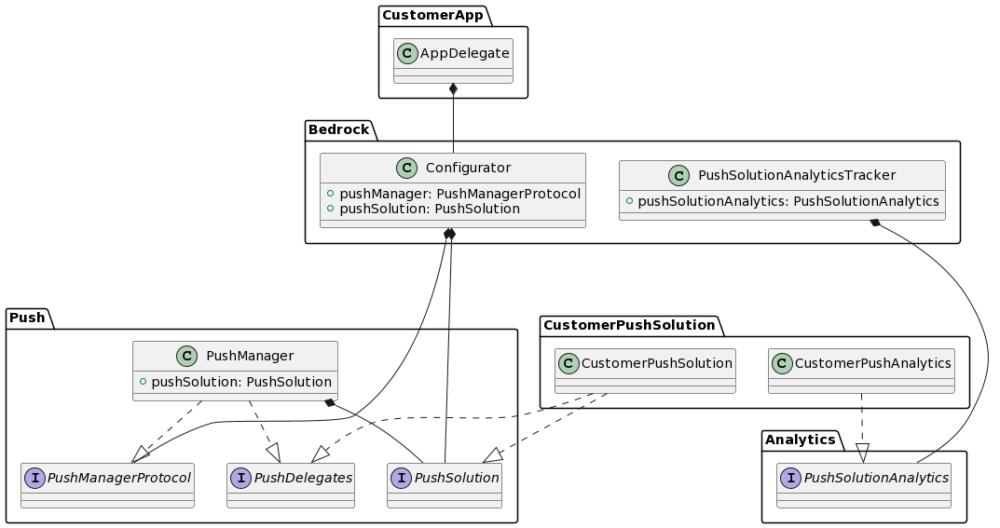
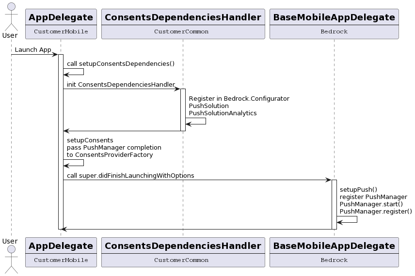
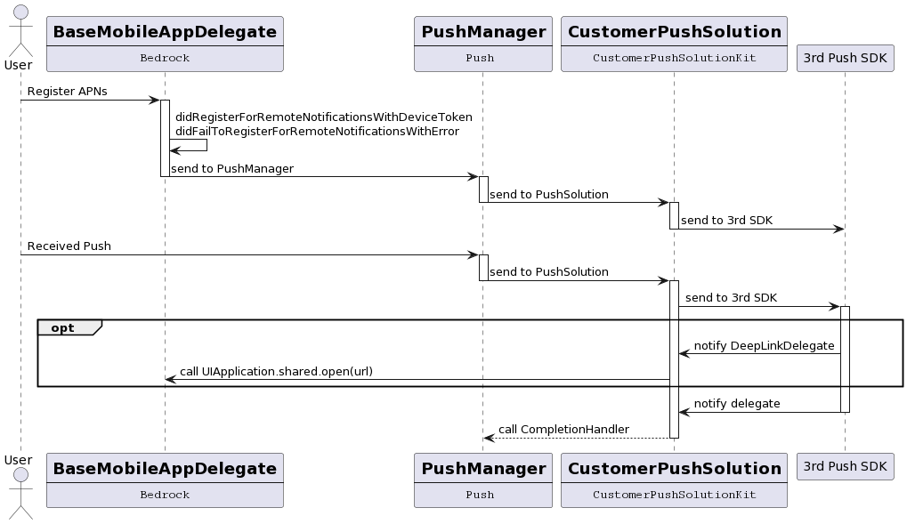

# Push

## Overview

Push is the notification system able to push info to a user of an app. There are two categories of notifications: 
* local: sent by application and triggered by the code of the app locally
* remote: sent by Apple servers with APNs  
See [User Notification](https://developer.apple.com/documentation/usernotifications)


## APNs Workflow

  
In Apple ecosystem, the remote notifications are handled by Apple through APNs (Apple Push Notification service). Each push provider uses APNs to send notification to target devices. 
See [APNs](https://developer.apple.com/library/archive/documentation/NetworkingInternet/Conceptual/RemoteNotificationsPG/APNSOverview.html)


## Usage of Push in Bedrock apps

At Bedrock, the push are used by our customers to: 
* notify the users of news or information
* redirect the users to a specific view with a deep link

Default push solution used for our customer: [Airship](https:///www.airship.com)  
Videoland exception: [MarketingCloud](https://www.salesforce.com/products/marketing-cloud/mobile-marketing/)

The functional scope of notifications is handled by ULC Loop team. This scope includes: 
* remote notifications
* deep links embed in notification
* the provision of tracker analytics for push solutions


## Signing & Environments

APNs requires an authentication to send remote notifications.  
For this purpose, you need to register on [Apple Developer](developer.apple.com). Two possibilities: 

* preferably, use a unique key by Apple Team (.p8)
* generate a certificate by *BundleID* (.p12) 

Certificates need to be declared on Apple customer account (for every env possible). Management of certificates is easier/improved.  
Note: you need to have account/certificate on Apple customer account.  

It exists 2 environments of APNs, *development* and *production*. These environments are used in function of signing of the build.

| Signing type\Push Env | Development    | Production     |
| --------------------- | -------------- | -------------- |
| development           | :green_circle: | :red_circle:   |
| adhoc                 | :red_circle:   | :green_circle: |
| appstore              | :red_circle:   | :green_circle: |


## Architecture 

The push system in Bedrock is divided in 2 parts: 
* [Push](../../Submodules/Libraries/Push/README.md): communicates with **Bedrock**, handled the responses of iOS SDK and interfacing with a `PushSolution`
* CustomerPushSolution: implements a `PushSolution`, initializes, configures and communicates with Push 3rd SDK

The `PushManager` and the CustomerPushSolution are unique instances handled by Swinject.  
PushSolution is registered in BR container at the launch of the app. If push is not supported, then there is no push solution and BR will not register the PushManager.


### Class Diagram


## Workflows
### Launching App Sequence

  
This workflow is executed at each launch of the app. It allows the initialization of `PushManager`, the `PushSolution` and 3rd party Push SDK.  


### Register to APNs & Received notification


* Register APNs: The APNs register status from the system is sent to **Push**, **CustomerPushSolutionKit** and finally to 3rd party Push SDK
* Received Pushs: When the device receives a notification, iOS notify directly the **Push** module, who is charged to prevent the `PushSolution` and 3rd party Push SDK. In function of notification's payload, the SDK can notify the `PushSolution` if a deep link is present. 


## Analytics

Usually, 3rd party solution of Push allows collecting data. The **Analytics** module provides a protocol to allow to **CustomerPushSolution** abstract the sending of analytics to 3rd party solution. A tracker managing the dispatch of events is implemented in Bedrock, in [PushSolutionAnalyticsTracker](../../Submodules/Libraries/Bedrock/Bedrock/Library/Core/Push/PushSolutionAnalyticsTracker.swift)

## How to
### Add Airship solution to a customer
#### Requirements
* Access to Airship customer console
* Customer certificate for push 

#### Steps
* Declare Airship credentials into your customer project
    * Get Airship **app key** and **secret key** from Airship customer console
    * Add these keys in your customer xcconfig (for each environment)
    ```
    // Airship
    airshipAppKey = AIRSHIP_APP_KEY
    airshipAppSecret = AIRSHIP_SECRET_KEY
    // Scheme
    SCHEME = SCHEME_APP
    ```  
    * Add the following keys to your customer **info.plist** : 
        * key: `airshipAppKey`, value: `${airshipAppKey}`
        * key: `airshipAppSecret`, value: `${airshipAppSecret}`
        * key: `airshipAllowedUrls`, value: `["*"]`
        * key: `scheme`, value: `${SCHEME}`
    * Add static var for each keys in `Bundle+extension.swift` of your customer
    ```swift
    extension Bundle {
        static var scheme: String { `get`("scheme")! }
        static var airshipAppKey: String { `get`("airshipAppKey")! }
        static var airshipAppSecret: String { `get`("airshipAppSecret")! }
        static var airshipAllowedUrls: [String] { `get`("airshipAllowedUrls")! }
    }
    ```
* Add these credentials to `ConsentsDependenciesConfig` of your customer
* In customer's `ConsentsDependenciesHandler`, register `AirshipPushSolution` in `Bedrock.Configurator`
```swift
Bedrock.Configurator.container.register(Push.PushSolution.self) { _ in
    let airshipConfig = AirshipSolutionConfig(appKey: self.config.airshipAppKey,
                                              secret: self.config.airshipAppSecret,
                                              scheme: self.config.scheme,
                                              allowedUrls: self.config.airshipAllowedUrls)
    return AirshipPushSolution(config: airshipConfig)
}.inObjectScope(.container)
```
* Now, your customer has an Airship PushSolution, so Bedrock is able to init `PushManager` and handle Push ! :tada


## Links
* [Documentation UserNotification](https://developer.apple.com/documentation/usernotifications)
* [Documentation APNs](https://developer.apple.com/library/archive/documentation/NetworkingInternet/Conceptual/RemoteNotificationsPG/APNSOverview.html)
* [README Push](../../Submodules/Libraries/Push/README.md)
* [README AirshipSolutionKit](../../Submodules/Libraries/Airship/AirshipSolutionKit/README.md)
* [README MarketingCloudSolutionKit]()
